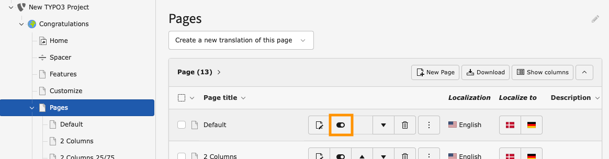

# Manage Media Assets

<!--#TYPO3v13 #Beginner #Backend #Filelist @username -->

TYPO3 manages all media assets — such as images, documents, and videos — centrally through the Filelist module.
Every file you upload is stored in a file storage and can be referenced from multiple pages and content elements without duplicating it.
Understanding how to upload, organise, and reference files in the Filelist module is essential for keeping your project's media tidy and maintainable.

## Learning objective

In this step-by-step guide you will upload a media asset to the TYPO3 Filelist module, organise it in a folder, and reference it in a content element.

## Prerequisites

### Tools and technology

* A computer with a local TYPO3 installation
* Access to the TYPO3 backend (admin account or a user with Filelist access)
* A web browser
* A sample media file (for example an image in PNG or JPEG format)

### Knowledge and skills

* You know how to [Log in to the TYPO3 backend](LogInToTheTypo3Backend.md).

## Upload a media asset

1. Log in to the TYPO3 backend as explained in [Log in to the TYPO3 backend](LogInToTheTypo3Backend.md).
2. In the module menu on the left, click **Filelist** under the *File* section.
3. In the folder tree, select the folder where you want to upload your file (for example `fileadmin`). If you need a new folder, right-click the parent folder and choose **New Folder**, then enter a name.
4. Click the **Upload Files** button in the document header area.
5. In the upload dialog, drag and drop your file or click to browse your local file system, then select the file you want to upload.
6. Wait until the upload progress bar completes. The file now appears in the file list.

   

> [!NOTE]
> TYPO3 respects the maximum upload size configured in your PHP settings (`upload_max_filesize` and `post_max_size`). If a file upload fails, check these values in your server configuration.

> [!TIP]
> Use descriptive file names before uploading (for example `company-logo.png` instead of `IMG_4523.png`). This makes assets easier to find later.

## Reference a media asset in a content element

7. Switch to the **Page** module by clicking **Page** in the module menu.
8. Select the page where you want to use the uploaded file.
9. Edit or create a content element (for example a *Text & Media* element).
10. In the **Media** tab, click **Add media file**.
11. Browse to the folder where you uploaded the file, select it, and confirm.
12. Save the content element by clicking **Save**.

## Verify the result

13. Open your website's frontend in a new browser tab and navigate to the page where you added the media asset.
14. Perform a **hard refresh** (Ctrl + F5 or Cmd + Shift + R) to bypass the browser cache. The media asset should now be visible on the page.

## Summary

Congratulations! You have uploaded a media asset to the TYPO3 Filelist module, organised it in a folder, and referenced it in a content element on a page.

## Next steps

Now that you can manage media assets, you might like to:

* [Modify the page properties](ModifyingThePageProperties.md) to set a page-level media asset
* [Clear the frontend cache](ClearingFrontendCacheInTypo3Backend.md) if your changes do not appear immediately
* Explore metadata editing in the Filelist module to add alt text and captions

## Resources

* [File Abstraction Layer (FAL)](https://docs.typo3.org/permalink/t3coreapi:fal)
* [Filelist module](https://docs.typo3.org/permalink/t3coreapi:filelist-module)
