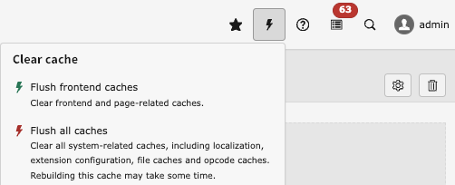

# Clearing All Caches Using the Clear Cache Menu

<!--#TYPO3v13 #Beginner #Backend #Cache @username -->

TYPO3 caches many different layers of your website, including rendered frontend pages, backend menus, TypoScript, icons, and compiled configuration.
Clearing only the frontend cache is enough for most editorial changes, but after larger changes, such as installing an extension, changing TCA, or updating TypoScript, you need to clear every cache layer at once.
The Clear Cache menu in the administrative toolbar offers a single action that does exactly this.

## Learning objective

In this step-by-step guide you will clear all TYPO3 caches at once by using the Flush all caches option in the Clear Cache menu.

## Prerequisites

### Tools and technology

* A computer with a local TYPO3 installation
* Access to the TYPO3 backend (admin account or a user with permission to flush all caches)
* A web browser

### Knowledge and skills

* You know how to [Log in to the TYPO3 backend](LogInToTheTypo3Backend.md).
* You can [Locate and use the TYPO3 backend's administrative toolbar](LocateAndUseTheTypo3BackendsAdministrativeToolbar.md).

## Flush all caches

1. Log in to the TYPO3 backend as explained in [Log in to the TYPO3 backend](LogInToTheTypo3Backend.md).
2. In the backend, locate the administrative toolbar at the top of the screen.
3. Click the lightning icon (the Clear Cache icon) in the administrative toolbar. A dropdown menu opens with two cache-related options.
4. From the dropdown menu, select **Flush all caches**.

   

> [!NOTE]
> "Flush all caches" clears system caches in addition to frontend content. The backend can feel slightly slower for the first page loads after the flush because each cache is rebuilt on demand.

> [!TIP]
> If you only changed content or assets, use [Clearing the Frontend Cache in the TYPO3 Backend](ClearingFrontendCacheInTypo3Backend.md) instead. It is faster and sufficient for editorial updates.

5. Watch the lightning icon briefly show a loading spinner. The spinner disappears once the flush is complete, usually within a few seconds.
6. Verify your change by opening your website's frontend in a new browser tab and performing a **hard refresh** (Ctrl + F5 or Cmd + Shift + R) to bypass the browser cache. The site should now reflect your latest changes.

## Summary

Congratulations! You have cleared every TYPO3 cache layer at once using the Flush all caches option in the administrative toolbar, and you know when to prefer this over clearing only the frontend cache.

## Next steps

Now that you can flush every cache, you might like to:

* [Clear only the frontend cache](ClearingFrontendCacheInTypo3Backend.md) for day-to-day editorial changes
* [Modify the page properties](ModifyingThePageProperties.md) and verify your changes on the frontend
* Explore the Install Tool to clear caches when the backend is not reachable

## Resources

* [Caching in TYPO3](https://docs.typo3.org/permalink/t3coreapi:caching)
* [The administrative toolbar](https://docs.typo3.org/permalink/t3coreapi:backend-toolbar)
